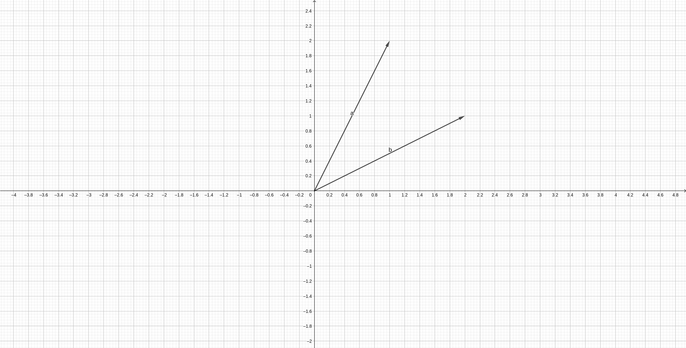
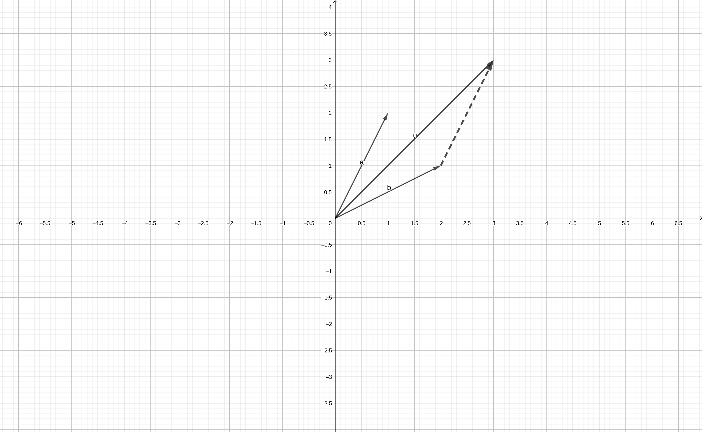
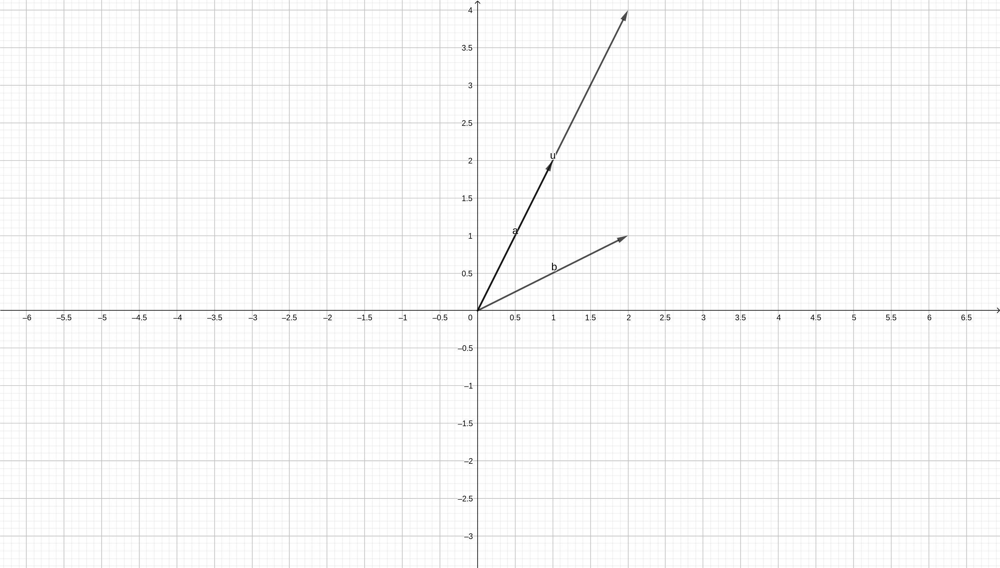

# ভেক্টর এর পরিচিতি
ভেক্টর এর নির্দিষ্ট সংজ্ঞা শুরুতে দিলে কিছুটা ঝামেলার মনে হতে পারে। একটা উদাহরণ দেই এর চেয়ে। আন্দাজে একটা ভেক্টর ধরে নিলাম, \(a=(1,2)\)। এই ভেক্টর \(a\) এর মধ্যে দুইজন সদস্য আছে। কথা হচ্ছে এই দুইজন সদস্য কি নির্দেশ করে? **আপাতত উত্তর হল, গ্রাফের মধ্যে একটি বিন্দু**। যেহেতু দুইজন সদস্য তাই একটা 2D গ্রাফে এর অবস্থান। আরেকটা ভেক্টর \(b=(2,1)\) আনলাম। যেহেতু \(a,b\) দুজনেরই দুইজন করে সদস্য তারমানে এরা একই গ্রাফে অবস্থান করতে পারে। এখন দেখি আসলে এদেরকে আঁকবো কিভাবে। ছবি ১.১ লক্ষ্য করুন। 

*ছবি ১.১ গ্রাফের মধ্যে ভেক্টর*

এভাবে সাধারণত ভেক্টর আকা হয়। কিন্তু আমি তো একটু আগে বললাম ভেক্টর হল বিন্দু, তাহলে এখানে লাইন আসলো কই থেকে! **ভেক্টর হল দিক সহ বিন্দু।** দিক নির্দেশ করতে হলে শুরু আর শেষের বিন্দুর প্রয়োজন হয়। যদি শুধু একটা বিন্দু (অনেকগুলো সদস্য) দিয়ে ভেক্টরকে প্রকাশ করা হয়, তাহলে ধরে নেয়া হয় যে শুরুর বিন্দু হচ্ছে \((0,0)\)। এখন আমি যেহেতু এই ভেক্টর এর সদস্য দুইজন তাই এদেরকে আঁকার জন্য আমার দুইটা *axis* বা অক্ষ ব্যবহার করতে হয়েছে। আপাতত এটাই ভেক্টর এর পরিচিতি। 

## যোগ
উপরের \(a,b\) ভেক্টর এর যোগ করা যায় সহজেই। এদের সদস্যগুলোকে একটা আরেকটার সাথে যোগ করলেই হয়। মানে, \(u = a+b=(3,3)\)। কিন্তু বিষয় হল এই যোগ কি বুঝায়। দুইটা ভেক্টর এর যোগ হচ্ছে অনেকটা এরকম-
> একটা ভেক্টর এর শুরুর বিন্দু কে অন্য ভেক্টর এর শেষে নিয়ে যাওয়া। 

মানে আগে আমরা \((0,0)\) কে ভেক্টর এর শুরুর বিন্দু হিসেবে ধরে নিতাম, কিন্তু যোগ করার পর নতুন যে ভেক্টর পাওয়া যায় তা হচ্ছে আগের একটা ভেক্টর কে আরেকটা ভেক্টরের মাথায় নিয়ে যাওয়া। সরানোর পর ভেক্টরটা যে বিন্দুতে পৌঁছাবে, ওইটা হল আমাদের নতুন ভেক্টর, \(u\)। ছবি ১.২ লক্ষ্য করি। 

*ছবি ১.২ ভেক্টর যোগ*

এখানে দুইটির যোগফল হল \(u=(3,3)\)। কিন্তু ডানপাশে ডট ডট আরেকটা ভেক্টর আছে, ওইটা আসলে \(a\) এবং দেখা যাচ্ছে যে, \(a\) এর শুরু যদি \(b\) এর শেষ থেকে হয় তাহলে \(a\) উভয়ের যোগফলে গিয়ে শেষ হয়। এখানে \(b\) কে সরিয়ে \(a\) এর উপর নিলেও একই উত্তর আসবে। 

## গুন
কোন সংখ্যা দাড়া ভেক্টরকে গুন করলে ওই ভেক্টর শুধু লম্বায় বড় বা ছোট হয়। যেমন, \(u = 3a = (3,6)\)। 

## নোটেশন
এতক্ষণ ভেক্টরকে দুইটি ব্র্যাকেটের মধ্যে রাখলেও যেকোনো ভেক্টর, \(v\) এর আসল রূপ হল এরকম,
\)
v = \begin{bmatrix}
    v_1 \\
    v_2
\end{bmatrix}
\)
শুধুমাত্র লেখকদের সুবিধার জন্য বেশিরভাগ বইয়ে \(v=(v_1,v_2)\) লেখা হয়। 