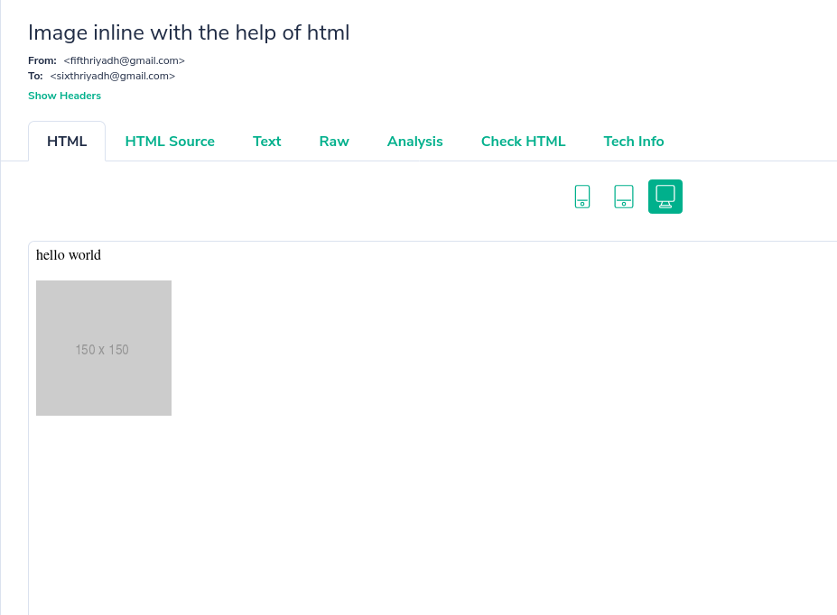

# Hello World in Email

Python has new `EmailMessage` class in `email` module. Here are a few examples using it.


```python
import smtplib
from email.message import EmailMessage
sender_email = "sender@mail.com"
receiver_email = "receiver@mail.com"
```

`EmailMessage` class only creates, manipulates and manages each mail we send, `smtplib` is the one that actually sends it.


```python
msg = EmailMessage()
str(msg)
```


    '\n'


`str(msg)` outputs a readable format of the msg object. For now our message is empty. Let's add headers. Headers are key, value pair that stores information about our message. For example, `subject`, `from`, `to`, `date` etc.


```python
msg['Subject'] = "this is test subject"
msg['To'] = receiver_email
msg['From'] = sender_email
str(msg)
```


    'Subject: this is test subject\nTo: receiver@mail.com\nFrom: sender@mail.com\n\n'


actual content to the msg object is set through the `set_content` method.


```python
msg.set_content("Hello World")
```

msg object now looks like this-
```
Subject: Hello world in subject
To: receiver@mail.com
From: sender@mail.com
Content-Type: text/plain; charset="utf-8"
Content-Transfer-Encoding: 7bit
MIME-Version: 1.0

Hello world inside message. This is known as message body

```
We see 3 extra information. Content-Type is type of the msg body. Content-Transfer-Encoding is how the string in message body is encoded. Existance of `MIME-Version: 1.0` indicates that this message maintains MIME (Multipurpose Internet Mail Extensions) standard.

## MIME in short
MIME basically says that each message body consists of multiple parts. A message is described as maintype and subtype. Generally written as `maintype/subtype`, e.g., `text/plain`, `text/html`, `application/pdf`, `image/png` etc. These informations are stored in `Content-Type` header that we have seen before. These MIME types let's us attach images, files, html inside a mail. Since a message body can have multiple combination of these, there should be some MIME type that lets us contain any of these inside the body. Those MIME types are known as `multipart/mixed`. So, imagine a tree data structure, root `multipart/mixed` will contain concrete types such as `text/plain` as nodes, and these nodes will contain the actual message or files as leaves.

## Sending Mail via SMTPlib

I will use `mailtrap.io` as server, because using gmail or microsoft account and sending numerous emails during development may result in marking the account as spam. SMTP requires connecting to an smtp server via specific host and port, and login if necessary. Then we can send fake emails and see them in `mailtrap.io`'s inbox.


```python
with smtplib.SMTP("smtp.mailtrap.io", 2525) as server:
    server.login(username, password)
    server.send_message(msg)
```

Message sent!


To do this with gmail or microsoft, we just need to change our username, password, host and port with their given configs which is available online.

# Advance Examples

## Text and Image in the body


```python
msg = EmailMessage()
msg['Subject'] = "text and image in the body"
msg['From'] = sender_email
msg['To'] = receiver_email
msg.make_mixed()

str(msg)
```


    'Subject: text and image in the body\nFrom: sender@mail.com\nTo: receiver@mail.com\nContent-Type: multipart/mixed; boundary="===============4058359157311941825=="\n\n--===============4058359157311941825==\n\n--===============4058359157311941825==--\n'


Content-type says that our msg is now `multipart`. But we need subparts to include inside multipart. `email.message.MIMEPart` class can be used to create that. We will need two subparts, one for a sample text, and another for a sample image to display.


```python
from email.message import MIMEPart
text_part = MIMEPart()
text_part.set_content("Hello World", subtype="plain")

image_filepath = '150.png'
with open(image_filepath, 'rb') as f:
    img_data = f.read()

image_part = MIMEPart()
image_part.set_content(img_data, maintype="image", subtype="png", disposition="inline")

msg.attach(text_part)
msg.attach(image_part)

with smtplib.SMTP("smtp.mailtrap.io", 2525) as server:
    server.login(username, password)
    server.send_message(msg)
```

Result:


Those random seeming string is the image as binary placed inline. But not parsed and presented in color. HTML can do that. We will read the image as byte stream and insert that into the `src` of html `` tag.

## Image inline using HTML

```python
import base64
msg = EmailMessage()
msg['Subject'] = "Image inline with the help of html"
msg['To'] = receiver_email
msg['From'] = sender_email
msg.set_content("This will be only shown in text and raw format, HTML won't show this.")

img_data = base64.b64encode(open(image_filepath, "rb").read()).decode()

html_part = f"""\
<html>
 <body>
    <p>hello world</p>
   
 </body>
</html>
"""

msg.add_alternative(html_part, subtype="html")

with smtplib.SMTP("smtp.mailtrap.io", 2525) as server:
    server.login(username, password)
    server.send_message(msg)
```

as we see the long line of text via `set_content` was not shown. Only the HTML is shown. This type of message is known as `multipart/alternative`, where main content will be in plain text and alternative graphically rich version will be put inside html. 



The same thing can be done with `MIMEPart` method too.

## HTML as MIMEPart


```python
msg = EmailMessage()
msg['Subject'] = "Image inline with the help of html"
msg['To'] = receiver_email
msg['From'] = sender_email

msg.make_mixed()

text_part = MIMEPart()
text_part.set_content("Hello World", subtype="plain")
msg.attach(text_part)

img_data = base64.b64encode(open(image_filepath, "rb").read()).decode()

html = f"""\
<html>
 <body>
    <p>hello world</p>
   
 </body>
</html>
"""

html_part = MIMEPart()
html_part.set_content(html, subtype='html')

msg.attach(html_part)

with smtplib.SMTP("smtp.mailtrap.io", 2525) as server:
    server.login(username, password)
    server.send_message(msg)
```

# Attach File(s)

File attachment is done using `add_attachment` method of msg. But msg has to be `multipart/mixed` because only than it can store message in text, html as well as any other file type in its nodes.


```python
msg = EmailMessage()
msg['Subject'] = "Image inline with the help of html also has ATTACHMENTS"
msg['To'] = receiver_email
msg['From'] = sender_email

msg.make_mixed()

img_data = base64.b64encode(open(image_filepath, "rb").read()).decode()

html = f"""\
<html>
 <body>
    <p>hello world</p>
   
 </body>
</html>
"""

html_part = MIMEPart()
html_part.set_content(html, subtype='html')

msg.attach(html_part)

# image attachment: normal file read in python, than create a multipart
with open(image_filepath,'rb') as f:
    only_image = f.read()

msg.add_attachment(only_image, maintype="image", subtype="png")

# pdf attachment
with open("A Sample PDF.pdf", 'rb') as f:
    pdf_file = f.read()

msg.add_attachment(pdf_file, maintype="application", subtype="octet-stream",
                  filename="A Small PDF.pdf", disposition="attachment")

with smtplib.SMTP("smtp.mailtrap.io", 2525) as server:
    server.login(username, password)
    server.send_message(msg)
```

So, we have two attachment here also with html body. The second attachment's filename is shown because we did it manually.


Further resources:
1. https://blog.mailtrap.io/sending-emails-in-python-tutorial-with-code-examples/
2. https://docs.python.org/3/library/email.contentmanager.html#email.contentmanager.ContentManager.set_content
3. https://blog.mailtrap.io/sending-emails-in-python-tutorial-with-code-examples/